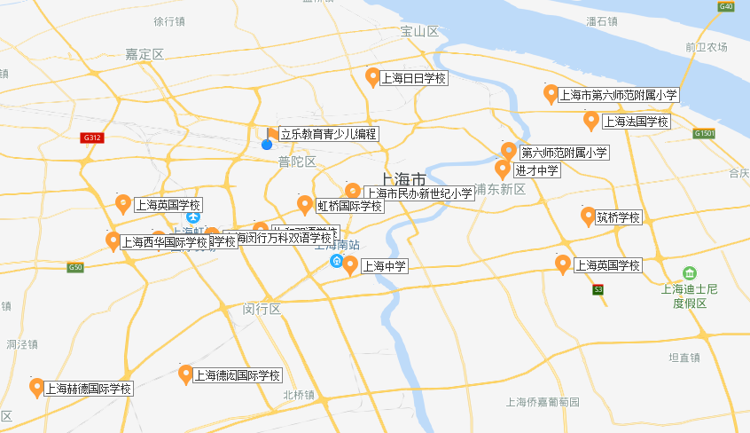

## 关于我们

Code the Future——编创梦想，程就未来

### 立乐创始人

立乐教育科技（上海）有限公司是全球首家由以色列人和中国人在中国联合创办的教育科技公司，由Ami Dror和田会军先生联合创立，致力于为6-18岁的孩子提供最具创新的编程教育。

立乐教育的课程研发团队均来自海外名校及国内一流大学，教研团队则是由美国芝加哥埃里克森儿童发展研究院主管教学科研常务副校长陈杰琦博士、科罗拉多丹佛大学数字化学习架构师莱恩•斯科根、清华大学左怀青等国际教育专家组成。

当今世界是科技快速发展的世界，成功将会越来越难。立乐教育认为，未来势必会属于自我学习能力强、不断适应新环境的精英。

### 开设了立乐编程课程的学校（上海）

在上海，已经有二十多所学校开设了立乐教育提供的编程课程。

### 公司历程

2016年9月：公司成立

2017年9月：产品正式上线，第1个线下活动，第1所学校，第1个在线学员

2018年9月：累积举办了50多次线下活动，20多所学校，2000多个在线学员

2019年9月：期待你的加入

