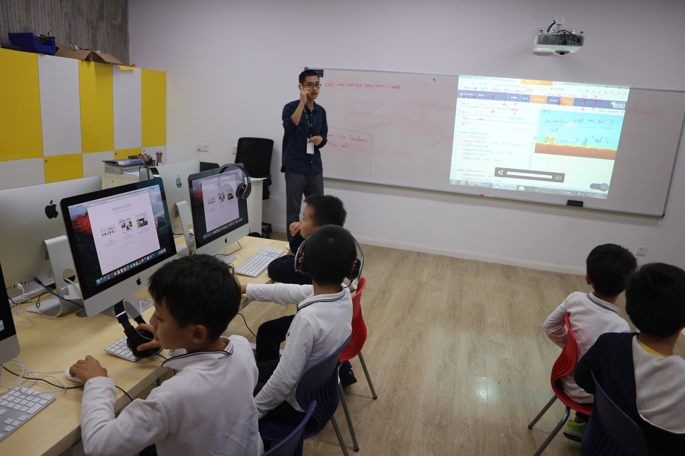

## 上课形式

立乐教育课程上课形式类别

| 上课形式   | 上课方式 | 上课时长    | 学员           |
| ---------- | -------- | ----------- | -------------- |
| 在线1对1   | 视频教学 | 40分钟/课时 | 6-18岁所有学员 |
| 在线大班课 | 视频教学 | 40分钟/课时 | 6-18岁所有学员 |
| 线下小班课 | 线下教学 | 60分钟/课时 | 仅限入驻学校   |

### 在线1对1课程

**上课形式：**一对一在线视频教学

**上课时间：**滚动式开班，预约制上课。学员可根据学习安排，自主选择周一至周五晚6-8点，或者周六周日全天10-20点任意时间段。

**上课时长：**每周1次课，每次2个课时，每个课时40分钟

### 在线大班课

**上课形式**：视频教学

**上课时长**：每周1次课，每次2个课时，每个课时40分钟，每周固定时间上课

### 线下小班教学

**上课形式**：线下教学

**上课时长**：每次课1~2节，每周1~2次课

