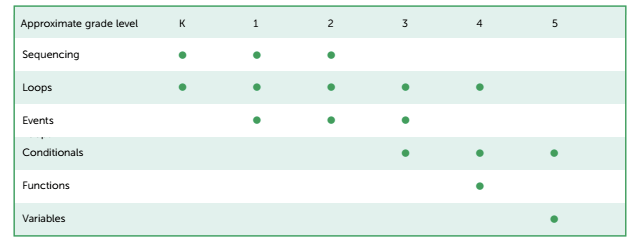
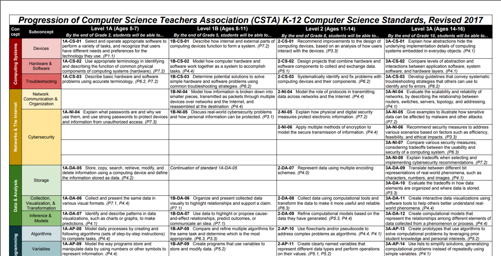

## 课程介绍

每个人都应该学习编程，因为它教会你思考。—— 乔布斯

### 对话未来 Code the Future

编创梦想，程就未来

编程， 是孩子对话未来的语言 。如果说英语促进了世界范围内的交流，那么编程语言，在现在和未来，都将是世界上最通用的语言。

### 立乐课程介绍

立乐课程共分为5个阶段，满足6~18岁学员的不同需求。不同阶段的学员都可以选择最合适自身的课程开始学习。

### 课程特色

#### 覆盖全年龄阶段的体系化课程

满足6-18岁青少儿学习编程的需要，针对不同阶段的学员采用不同的教学内容，以符合学员当前的认知水平。

#### PBL式教学

以问题为导向的教学方法（PBL，Problem-based Learning项目式学习）的教学方式，寓教于乐，打造适合孩子的轻松课堂，不再刻板枯燥，让孩子爱上编程。

与传统的以学科为基础的教学法有很大不同，PBL 强调以学生的主动学习为主，而不是传统教学中的以教师讲授为主； PBL 将学习与更大的任务或问题挂钩，使学习者投入于问题中；它设计真实性任务，强调把学习设置到复杂的、有意义的问题情景中，通过学习者的自主探究和合作来解决问题，从而学习隐含在问题背后的科学知识，形成解决问题的技能和自主学习的能力。

#### 多学科结合

通过和多个学科进行结合，在学习编程的同时掌握数学、艺术、物理等学科知识。

#### 成熟的课程标准

参照最适用原则，我们的课程参考了美国CSTA标准、教育部最新信息技术课程标准、NOIP等权威标准，经过教学实践双重验证，开发出适合中国青少年的编程课程体系，让孩子领跑未来。

#### 完善的教师培训体系

严格的培训和考核，对每位教师进行严格的能力考核、培训辅导和综合评价。 

目前立乐拥有超过100名经验丰富的编程教师，为超过10000名来自世界各地的学员提供了编程教学服务。

### 各个阶段的课程介绍

#### Scratch图形化编程（L0）

兴趣启蒙阶段，针对6-8岁的少儿，最重要的是让他们对编程产生兴趣，正确引导少儿对计算机的认识。

#### Python 图形化编程（L1）

通过图形化编程，锻炼孩子的逻辑思维能力。

逻辑思维能力不仅是学好编程必须具备的能力，也是学好其他学科，处理日常生活问题所必须的能力。

编程是用计算机来反映客观世界的一门学科，逻辑性很强、很严密，通过学习编程，在思考分析问题和完成程序的过程中培养逻辑思维能力。

#### Python 趣味编程（L2）

这个阶段的少儿正是开始产生抽象思维的时候，通过学习编程强化少儿抽象思维。

抽象思维是用词进行判断、推理并得出结论的过程，又叫词的思维或者逻辑思维。抽象思维以词为中介来反映现实，这是思维的最本质特征，也是人的思维和动物心理的根本区别。 

#### Python 科学计算与人工智能（L3）

数据思维是根据数据来思考事物的一种思维模式，是一种量化的思维模式，是重视事实、追求真理的思维模式。 

在学习编程中，掌握数据之间的相互关系，为将来学习数据分析、大数据等方向打下坚实的基础。

课程依据的是教育部最新制定的信息技术课程标准

#### NOIP信息学奥赛（L4）

优秀的学生可以通过参加NOIP课程，挑战奖杯，获取顶尖学府自主招生的资格。

|                | 推荐起点 | 课程目标       |
| -------------- | -------- | -------------- |
| NOIP普及组课程 | 初中     | 普及组获取奖项 |
| NOIP提高组课程 | 高中     | 提高组获取奖项 |

### 各个阶段课程对比

| 等级 | 阶段      | 工具    | 编码 | 展示 | 项目类型         | 目标     |
| ---- | --------- | ------- | ---- | ---- | ---------------- | -------- |
| L0   | 1-2年级   | Scratch | 图形 | 图形 | 动画、游戏       | 兴趣启蒙 |
| L1   | 3-4年级   | Python  | 文字 | 图形 | 动画、游戏、工具 | 抽象思维 |
| L2   | 5-6年级   | Python  | 文字 | 图形 | 动画、游戏、计算 | 逻辑思维 |
| L3   | 7年级以上 | Python  | 文字 | 文字 | 工具、计算、分析 | 数据思维 |
| L4   | 7年级以上 | C++     | 文字 | 文字 | 算法、数据结构   | 挑战奖杯 |

### 立乐课程标准

和其他学科教育标准一样，立乐的编程课程标准分为核心概念和核心实践两部分，其中核心概念侧重在内容领域，而核心实践注重行为。

#### 核心概念

- 算法和规则

  

- 计算机系统

  什么是计算机，计算机有哪些部分组成

- 数据和分析

- 计算机的影响

- 网络和互联网

#### 核心实践

- 培养包容的计算机文化
- 围绕计算机展开合作
- 确认并定义计算问题
- 发展和使用抽象
- 创造计算机作品
- 测试并改善计算机作品
- 关于计算机的交流

### 课程开发依据的标准

参考美国CSTA标准研发，教学实践双重验证，开发出适合中国青少年的编程课程体系，让孩子领跑未来。 

#### CSTA课程标准

CSTA，即计算机科学教师协会，由美国计算机协会(ACM)于2004年成立，发展到现在，成员数量已经超过25000名。而且成员构成非常多元化，不仅涵盖了K-12各个阶段（小学、初中、高中）CS 学科的一线教师，还包括大学教师、工业界及政府成员，其他非盈利组织成员，学生父母等。这些成员来自于145个国家。

CSTA 的合作伙伴包括 ACM 和政府基金，谷歌、微软、甲骨文等高科技公司，code.org 等机构， 协会的使命是为全球计算机科学教师赋能，促进计算机科学教育的发展。

#### 与CSTA标准对照关系

我们的课程依据CSTA课程标准制定，课程内容与世界标准接轨。

| 立乐标准 | 年龄    | CSTA标准 |
| -------- | ------- | -------- |
| Level 0  | 6-8岁   | Level 1A |
| Level 1  | 9-10岁  | Level 1B |
| Level 2  | 11-12岁 | Level 2  |
| Level 3  | 13-15岁 | Level 3A |
| Level 4  | 16-18岁 | Level 3B |

