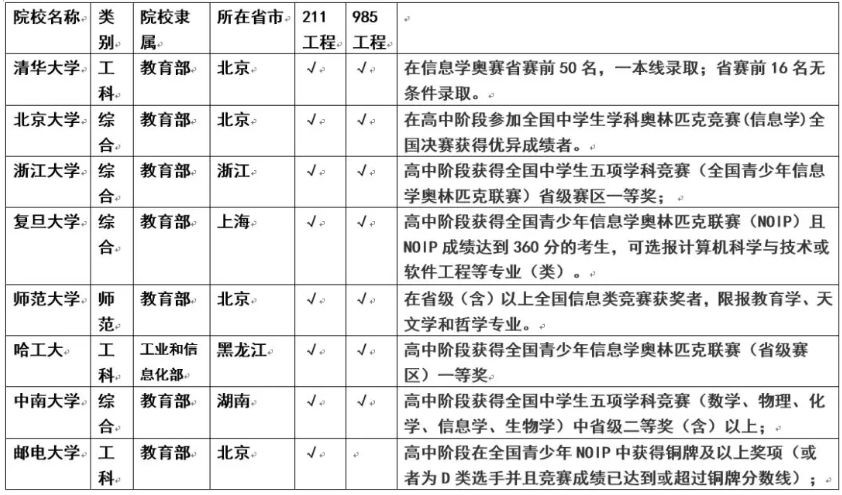

## 为什么要学习编程

编程其实是一种思维，是一种工具，对孩子来说是一种综合能力的展现和提高，让孩子从小学习编程至少有三个层面的好处

### 第一层面：在人工智能时代，编程是每一个孩子必备的基本能力

在美国，编程已经成为孩子继阅读、写作、算术这三项基本能力外所需掌握的第四项必备技能。

不仅仅是美国，在英国、德国、日本等发达国家，少儿编程要么已经被列入幼龄阶段必修课，要么已经成为家长最火爆的需求。

我们并不希望，孩子长大之后，跟不上他们那个时代的变化。

而我们更希望，孩子可以与时代同步，从容生活乃至引领时代。

好比英语是通向世界的语言，编程就是未来的通用语言，未来的社会必定是科技社会，没有编程思维，都没法操控电器，跟现在不会用遥控器一样。

### 第二层面：编程能够提升孩子各方面的能力，有助于学习

- 能够强化孩子的逻辑思考，抽象思考能力，孩子在学习编程的过程中，思维会变得活跃，敏捷、严谨、完整；处事善变，不死板。
- 机器只明白对和错，没有“大概”，“也许”，孩子在过程中会更加专注细心和耐心，改掉注意力不集中的毛病；
- 帮助孩子整理信息，吸收融合能力；
- 训练孩子想象力和解决问题能力；
- 是一种新的表达方式，新的学习方法，会让孩子变得更加自信。

### 第三层面：学习编程对孩子升学有重大帮助

浙江省已经于2017年将以编程为核心的信息技术学纳入了高考体系。现在的小学生未来高考的时候，编程一定是选择之一。

另外，青少年信息学奥林匹克竞赛受到越来越多高校招生的青睐，在清华、北大等高校自主招生的条件里，最大的比重就是科技和创新能力。

表：2018年各高校自主招生报名条件

​                                                  

而且，**在计算机方面的特长，对于孩子申请国外的大学非常有帮助**。如果要出国深造，申请世界名校，会编程就是最大的利器。杭州二中高中女生郭文景，高一时就获得了全国青少年信息学奥林匹克联赛(浙江省赛区)一等奖。曾受麻省理工邀请参加比赛，获得北美编程邀请赛第二名，本科被哈佛大学录取。在美国，她还亲自为外国的小孩进行编程授课。

**学编程的其他好处**

**各类工作对编程技能的要求越来越高**

工作中，从战胜国际象棋选手到驾驶飞机，再到进行股票市场的交易，计算机在现代生活的各个领域无孔不入。可孩子尚未对这项技术的理解和使用做足准备。

人类将进入人工智能的伟大时代，人工智能在创造巨大价值的同时也会取代很多领域的工作岗位。未来15年，50%的人类工作将会被人工智能所取代，编程会变得越来越重要。如果让孩子从小就学编程，这会让孩子的未来充满了更多的可能。 

来自一位博士研究员的话：

“这都不用论证了。学习编程，不一定就能成编程天才或者Geek。但那种思维模式能影响孩子一辈子。现在咱搞研究都知道，这年头不会编程似乎都不能搞研究了。动不动就大数据什么的。这是一种趋势，计算机语言就是一门外语，迟早都要普及的。

编程的思维方式跟玩乐高，搭积木没什么差别。就是模块化的思路。将复杂的目的，分解成一步步简单的步奏，然后将这些步奏有效地组合起来。这是啥？难道不就是少儿编程的设计目的吗？

会不会编程对实验设计可能没什么影响。但是数据总结和分析的时候影响很大啊。尤其是当你需要处理几千张看上去没什么差别的图片的时候。”

**学习编程，孩子不再沉迷于游戏**

科技飞速发展对人们生活最直接的影响就是：手机。现在，手机是每个人的必备品，孩子也不例外。但是，这就面临很大的隐患：孩子有了手机可以更好的联系，但是手机里有各种游戏，会影响孩子的学习，甚至会沉迷于游戏。面对这样的困扰，很多家长表示心有余而力不足。

但是，编程可以让孩子将对游戏的沉迷转换为对游戏开发的探索。孩子可以参与游戏的开发设计，为游戏编程，从而对游戏有一个全新的认识。

前几天采访一位优秀学员家长时，他向我分享了自家“熊”孩子学习编程之后的变化：

“以前跟我一块出去逛街的时候，一路上都在打游戏，头都不带抬一下的，自从学了编程之后，对玩游戏好像不感兴趣了，更加喜欢研究这个游戏是怎么被设计出来的！太神奇了，我以前怎么说他都戒不掉游戏的...”

玩游戏本质上来说就是一种小孩子的社交行为。他们喜欢玩游戏，但并不是沉迷游戏本身，而是沉迷在打榜过程中获得的成就感，当有更加高级更加能“装逼”的东西出现在同一个社交圈里时，他岂能不喜欢？

