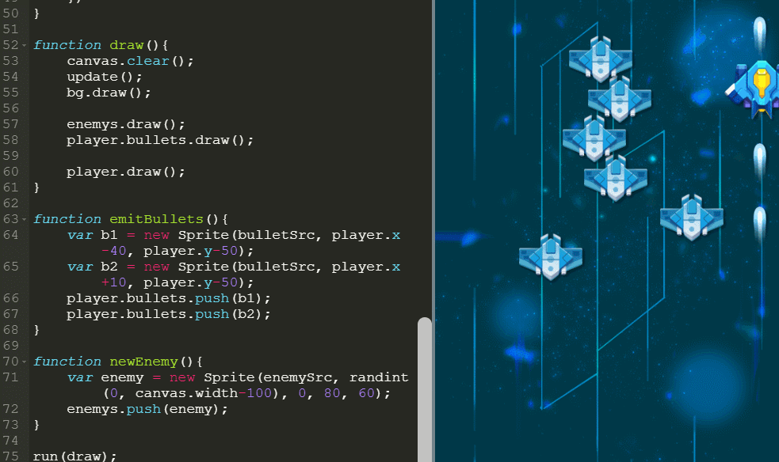

## 为什么要学JS

提高学习编程，许多人第一反应就是 “难”。的确，编程作为一个和计算机交流的语言，语法非常严谨，任何一个小错误都可能导致程序运行出错，因此，在教学时一般采用自下而上的方式，先花费大量的时间讲述基本概念，然后是大量而冗长的练习。在这之后，才开始接触一些编程的应用，从而，真正能体会到编程乐趣的人少之又少，大部分学生都在学习过程中降低了对编程的兴趣，视“编程”为猛虎，从此不敢再碰编程一下。

针对这种情况，我们开发了这一系列的图形编程课程。课程以自上而下的方式，先体验编程乐趣，再讲解编程知识，不再拘泥于讨论语法细节，而在于使用编程来开发项目，在项目开发中不断的去应用编程语法知识。我们认为，应用->反馈->学习的途径，是学习编程并保持对编程兴趣的最好方式。

### 做游戏，学编程。

俗话说，兴趣是最好的老师。本书利用最少的语法知识，进行游戏的开发。再把游戏开发应用于JavaScrip语言教学。从无到有开发游戏，通过游戏案例逐步应用语法知识，提升对编程的兴趣和能力 。

**例子：做游戏，学编程**

### 为什么选择JavaScript

JavaScript是一个网页脚本语言，几乎所有的网页应用都离不开JavaScript，可以预知的是，在今后很长一段时间内（十几年），JavaScript都会是网页中最主流的编程语言。在网页中，JavaScript几乎是天然可以运行，这就省去了安装编译环境所需要的大量时间。

小提示

在网页中，还有HTML以及CSS，他们都只是一种标记语言，并不是真正的编程语言

### 和Scratch对比

Scratch是MIT开发的一门面向儿童的图形化编程语言，适合于一二年级的小朋友。作为入门编程语言，Scratch简化了许多编程概念，不再需要小朋友输入文本，也几乎不会有语法错误发生，积木块式的编程语言不需要太多的学习就可以创作错许多动画和游戏。

从Scratch到实用编程语言，中间是有明显的间断，很多Scratch用的很熟练的小朋友在继续学习其他编程语言时，会明显感到不适，不仅简单的操作没有了，连输出也变的苍白无力，更别提到处无法预知的bug了。

因此，在深入学习编程语言之前，还需要使用选择更适合自身的编程语言和方式。

**编程学习过程**

| 等级 | 阶段      | 工具       | 编码 | 展示 | 项目类型         | 目标     |
| ---- | --------- | ---------- | ---- | ---- | ---------------- | -------- |
| L0   | 1-2年级   | Scratch    | 图形 | 图形 | 动画、游戏       | 兴趣启蒙 |
| L1   | 3-4年级   | JavaScript | 文字 | 图形 | 动画、游戏、工具 | 抽象思维 |
| L2   | 5-6年级   | JavaScript | 文字 | 图形 | 动画、游戏、计算 | 逻辑思维 |
| L3   | 7年级以上 | Python     | 文字 | 文字 | 工具、计算、分析 | 数据思维 |
| L4   | 7年级以上 | C++        | 文字 | 文字 | 算法、数据结构   | 挑战奖杯 |
