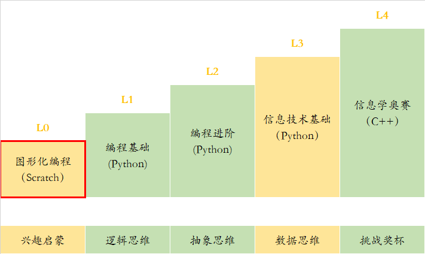
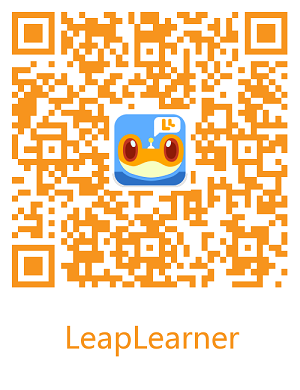

# Scratch（L0）课程介绍

### 课程定位

### 适用对象

（1）5~8岁学员（幼儿园到二年级）

（2）无编程基础，平时电脑接触比较少的小朋友

### 课程介绍

**本课程分为4个单元，每单元6个课时，共24课时。**

在完成本课程的学习后，学生应掌握下列知识：

（1）     理解编程的概念，了解scratch图形化软件的使用，和积木的基本操作与用法

（2）     掌握基本的积木应用，学习简单的思维逻辑与相对应的积木。

（3）     掌握与编程有关的数学和计算机知识，学习较难的思维逻辑与相对应的积木

理解对象与对象之间的关系，让对象之间传可以递消息或变量内容。

### 课程大纲

#### Unit 1：初识编程

##### 课程内容

学习scratch中最基本的运动类型积木与简单的功能型积木，通过让角色说、移动、和背景切换，实现简单的动画效果。并且熟悉scratch软件应用。

##### 单元目标

**知识与技能**

了解软件的基本操作，理解编程的概念，初步建立简单的编程思维，初步了解角色、背景的运动与编程之间的关系，探索移动与方向的关系，初步了解坐标与角色的位置关系 

**过程与方法**

通过积木，初步形成图形化的逻辑思维。能够在抽象思维与具体图形之间建立联系，尝试理解事物本身的特性，能够通过简单的积木，自己让角色在舞台中运动，实现简单的动画效果。

**情感态度与价值观**

消除对编程的陌生感和恐惧感，愿意参与编程活动，建立敢于尝试与探索的行为习惯。 

##### 课时列表

| 课次 | 课程   | 课程内容 |
| ---- | ---------------- |-----------------------------------|
| 1    | 初识编程  | 认识Scratch和界面操作 |
| 2    | 森林狂欢节   | 学习切换角色的各种造型    |
| 3    | 舞台表演  | 学习利用说话和录音积木让角色讲故事  |
| 4    | 小猫拍球  | 使用移动积木让角色来回运动   |
| 5    | 淘气男孩  | 学习使用碰到边缘反弹积木  |
| 6    | 猫抓老鼠  | 学习面向积木让角色跟随鼠标移动 |

#### 第二部分：

| 课次 | 课程  | 课程内容 |
| ---- | ---------------- |--------------------------|
| 7    | 百变小猫  | 改变角色的颜色特效 |
| 8    | 蒙迪做体操   | 学习使用改变角度控制角色运动方向 |
| 9    | 风车转转  | 学习使用图章的效果绘图    |
| 10   | 一起看日出   | 使用显示和隐藏积木 |
| 11   | 参加晚会  | 使用询问等待和回答积木认识新朋友 |
| 12   | 鲨鱼来了  | 学习简单的或运算控制多个角色 |

#### 第三部分：

| 课次 | 课程  | 课程内容 |
| ---- | ---------------- |--------------------------|
| 13   | 儿歌演奏  | 用音符积木设计儿歌 |
| 14   | 动物走迷宫   | 学习使用键盘控制角色移动  |
| 15   | 快乐的小猫   | 学习满足某条件就执行下一步   |
| 16   | 蜘蛛画图  | 使用落笔和抬笔的功能画图，和角的学习    |
| 17   | 旋转大风车   | 使用图层的功能，和数学中角度的学习  |
| 18   | 星空画板  | 改变画笔颜色，和随机积木的应用   |

#### 第四部分：

| 课次 | 课程  | 课程内容 |
| ---- | ---------------- |--------------------------|
| 19   | 按钮风扇  | 使用广播，实现角色之间的联系 |
| 20   | 猫咪爱吃鱼   | 深入学习多种条件判断积木的使用   |
| 21   | 动物循迹  | 了解循迹原理，通过判断积木让动物按轨迹行走 |
| 22   | 一起打猴子   | 建立变量，实现游戏分数，时间等功能。    |
| 23   | 玩骰子比大小 | 综合运用学习的积木并巩固变量积木的使用  |
| 24   | 节日贺卡  | 综合运用学习的积木为家人创作节日贺卡    |

#### 第五部分：海底乐园

| 课次 | 课程  | 课程内容 |
| ---- | ---------------- |--------------------------|
| 25   | 海底乐园(1)  | 项目实践课：通过变量可以出传递参数的功能，实现大鱼吃小鱼进行成长 |
| 26   | 海底乐园(2)  | 项目实践课：通过对判断语句的深入了解，实现鲨鱼在成长中是否可以吃其他鱼类 |
| 27   | 海底乐园(3)  | 项目实践课：学习简单的相对坐标概念，实现螃蟹对鲨鱼与自己距离的侦测 |
| 28   | 接鸡蛋(1) | 项目实践课：为游戏添加简单的故事情节。  |
| 29   | 接鸡蛋(2) | 项目实践课：实现鸡蛋随机从舞台的上方掉落   |
| 30   | 接鸡蛋(3) | 项目实践课：添加更多角色，丰富游戏内容  |

#### 第六部分：画图工具

| 课次 | 课程  | 课程内容 |
| ---- | ---------------- |--------------------------|
| 31   | 画图工具  | 综合使用图章、落笔、抬笔制作画板 |
| 32   | 幸运大转盘   | 巩固按键事件及图层的使用  |
| 33   | 炸裂星空  | 巩固克隆、移动积木的使用  |
| 34   | 弹力球    | 学习镜面反射原理，改变角色运动方向  |
| 35   | 太空飞船  | 综合使用条件判断，随机数和变量   |
| 36   | 避障小车  | 使用响度积木控制小车  |

#### 第七部分：小小数学家

| 课次 | 课程  | 课程内容 |
| ---- | ---------------- |--------------------------|
| 37   | 蚂蚁循迹  | 巩固多重条件判断的使用    |
| 38   | 知识问答  | 巩固询问回答积木，实现人机交互   |
| 39   | 绘本故事  | 使用切换背景制作有趣的绘本   |
| 40   | 成语解析  | 用所学积木，讲解一个成语  |
| 41   | 小小数学家（一） | 设计简易计算器，解决数学题目 |
| 42   | 小小数学家（二） | 制作一个数学题卡，判定得分   |
| 43   | 小小数学家（三） | 使用变量和条件判断积木解决鸡兔同笼问题  |

#### 第八部分：射击游戏

| 课次 | 课程  | 课程内容 |
| ---- | ---------------- |--------------------------|
| 44   | 射击游戏（一）   | 综合使用所学积木设计复杂项目 |
| 45   | 射击游戏（二）   | 综合使用所学积木设计复杂项目 |
| 46   | 射击游戏（三）   | 综合使用所学积木设计复杂项目 |
| 47   | 大鱼吃小鱼   | 综合使用所学积木设计复杂项目 |
| 48   | 水果忍者  | 综合使用所学积木设计复杂项目 |

