## Python常见问题与解答

### mac os系统

#### 出现ApplePersistenceIgnoreState 错误

解决方法：

在mac的“终端”输入如下命令后回车：

~~~
defaults write org.python.python ApplePersistenceIgnoreState NO
~~~

详情见视频11:39时的操作，链接如下：

<iframe src="http://cs.leaplearner.com/video/vs/sharing/ytN1zTVV#!aG9tZV92aWRlby03Njc1">
</iframe>


### windows系统

#### 无法安装python3.7

原因：Windows 7(sp1)及以下版本的系统，如windows xp，不支持python 3.5+版本

只能安装python 3.4，与python3.7一样，都可以用来上课和学习。下载地址如下：

<https://www.python.org/downloads/release/python-340/>

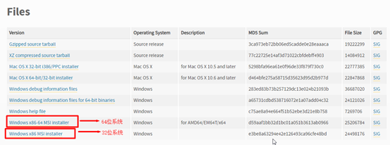


#### pyglet.gl.ContextException:Unable to share contexts

1、更新pyleap到最新版本，打开cmd窗口，运行以下命令

```shell
pip install -U pyleap
```

2、如果无法解决，下载驱动精灵更新显卡驱动(要官网的)

3、如果还不能用，在控制面板中查看设备管理器，如果有2个以上显示适配器的，禁用intel显卡后重启


#### Dll文件丢失

基本方法是把缺失dll文件放进指定目录，然后注册。丢失文件和安装方法见链接：

[https://rss.leaplearner.com/teachfiles/Text/dll缺失.zip](https://rss.leaplearner.com/teachfiles/Text/dll缺失.zip)

下载好后，先看安装方法：

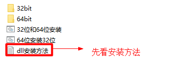

注：若没有你缺失的dll文件，请把问题反馈给我们。我们补充上去。


#### 无法定位程序输入点

错误提示：

无法定位程序输入点ucrtbase.terminate于动态链接库api-ms-win-crt-runtime-|1-1-0.dll

打开CMD，输入 winver.exe ，回车运行，查看当前Windows版本

```shell
winver.exe
```


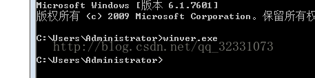

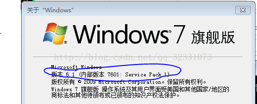

如果版本为7600，则首先安装：windows6.1-KB976932-X64.exe(https://www.microsoft.com/en-us/download/details.aspx?id=5842)，将版本升级为 7601:Service Pack 1，见下图(x64对应64位系统，x86对应32位系统)。再进行第4.2步；

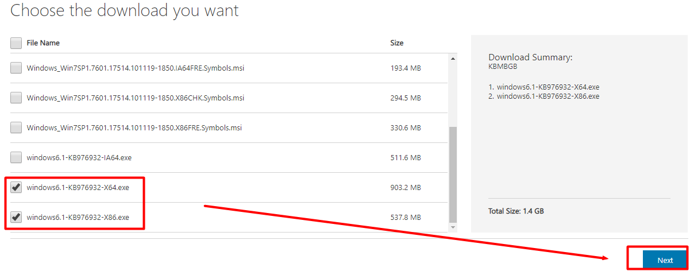如果版本如上图所示，为7601:Service Pack 1，直接进行第4.2步；

4.2安装：Microsoft .NET Framework 4.6.1 NDP461-KB3102438-Web.exe(链接见下方);

4.3安装：Visual C++ Redistributable for Visual Studio 2015 vc_redist.x64.exe(链接见下方);

4.4一般情况下，到第4.3步问题已经解决，但是如果再一次安装软件，还是会出错“无法定位程序输入点ucrtbase.terminate于动态链接库api-ms-win-crt-runtime-|1-1-0.dll”，那么可以安装补丁：Windows6.1-KB2999226-x64 .msu(链接见下方);

[https://rss.leaplearner.com/teachfiles/Text/dll文件无法连接到动态库.zip](https://rss.leaplearner.com/teachfiles/Text/dll文件无法连接到动态库.zip)


#### 拒绝访问 PermissionError


方法一：使用管理员身份运行cmd

https://jingyan.baidu.com/article/9c69d48fe9f1cb13c8024e67.html

方法二：

运行python -m leapserver 的指令在其他位置打开

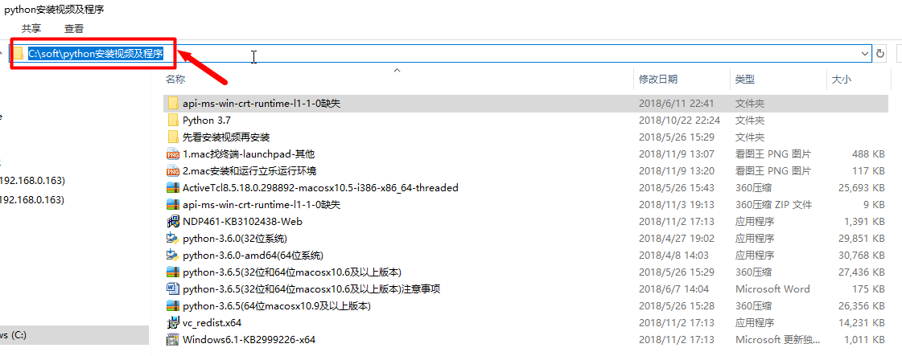

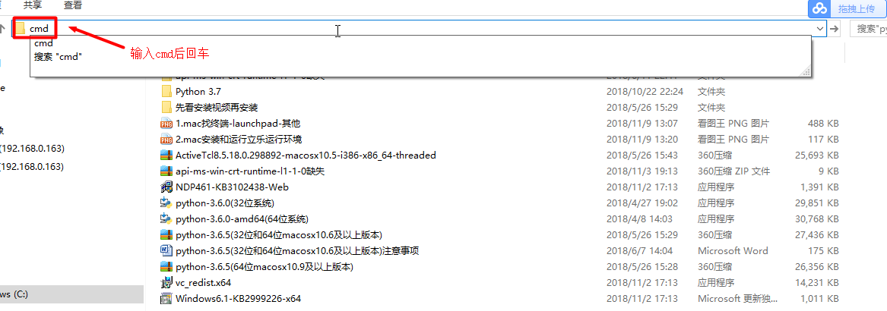

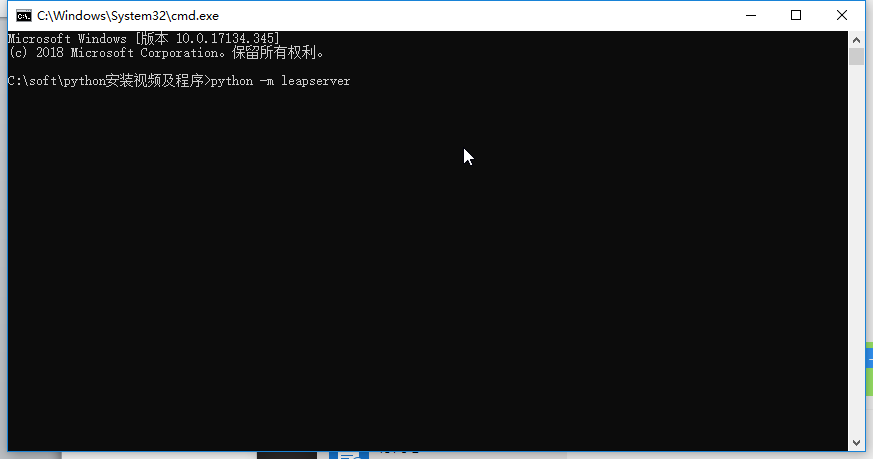

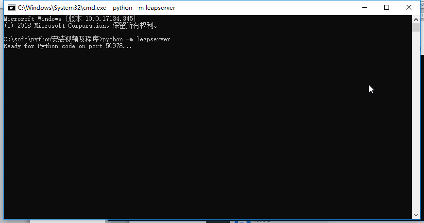


#### 无法访问windows installer服务

Python卸载不了或windows installer服务没开启，错误消息如下

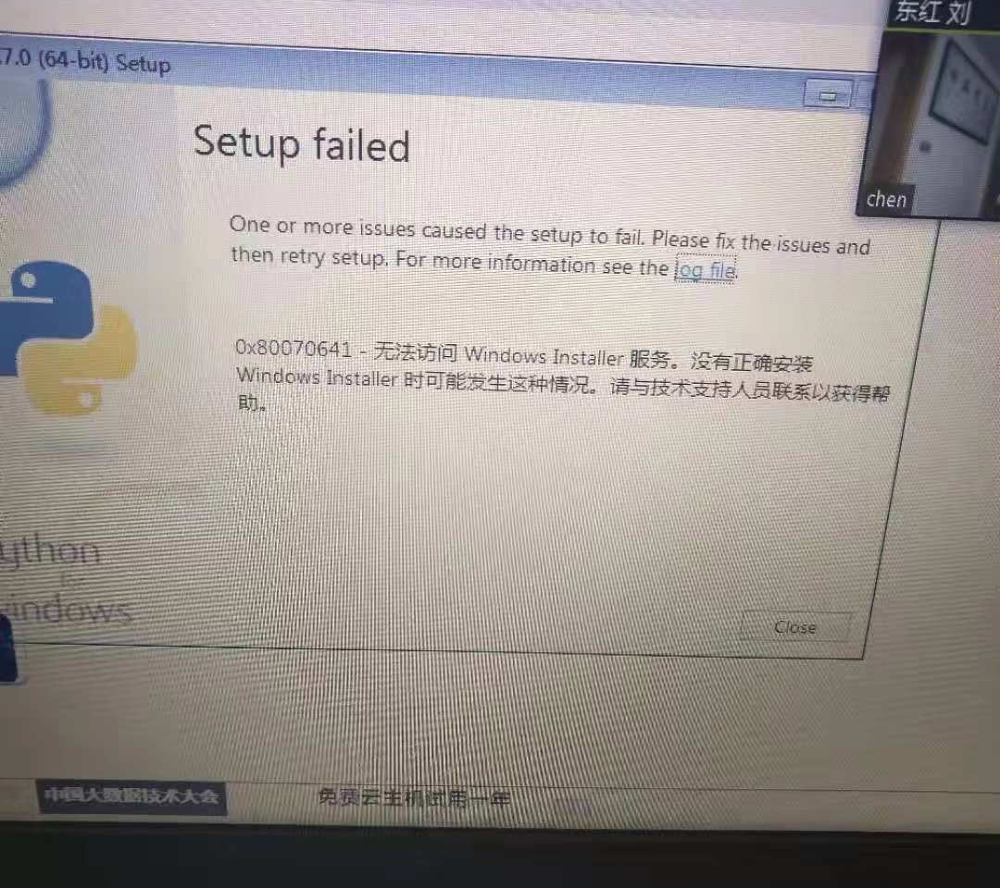

**方法一：**

在开始-运行框输入services.msc

```shell
services.msc
```

然后找到Windows Installer；然后双击它；然后点启动。再安装python，若不行再进行如下操作

**方法二：**

在开始-运行框输入卸载Windows Installer的命令：MSIEXEC /UNREGISTER；

```shell
MSIEXEC /UNREGISTER
```


然后再输入注册Windows Installer的命令MSIEXEC /REGSERVER。以上两个命令输入后没有任何反应就说明正常进行。再安装python

```shell
MSIEXEC /REGSERVER
```


#### 安装了Python，提示找不到python

安装Python时勾上了add path to……但是在cmd里输入python显示不是内部命令：

手动添加系统变量，步骤见视频：

<iframe src="http://cs.leaplearner.com/video/vs/sharing/ytN1zTVV#!aG9tZV92aWRlby03Nzgw">
</iframe>


### windows和mac共有问题


#### 运行无反应，浏览器F12查看有报错

可能原因：Chrome版本太低

升级到Chrome 51及以上的版本


#### 无法用pip安装外部库或pip不是内部指令

按理说重装python后自带pip(自动配置环境变量)，如果没有自带pip，就再单独安装pip。方法：

1.1在命令行输入：

~~~
curl rl https://bootstrap.pypa.io/get-pip.py -o  -o -o get-pip.py     
~~~

1.2在命令行输入：

~~~
python on get-pip.py 
~~~

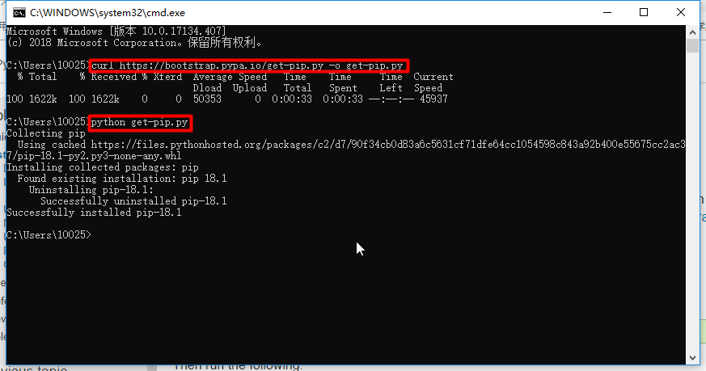

注：若不行的话，直接下载https://bootstrap.pypa.io/get-pip.py，然后双击或用python运行get-pip.py进行安装。